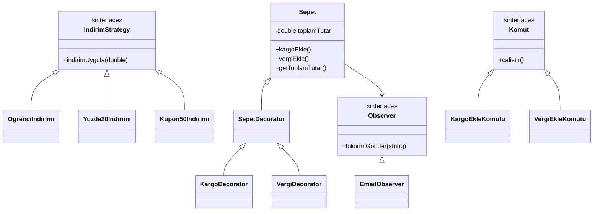

# Evrimleşen Sistem Ödevi

## Seçilen Konu: D - E-Ticaret Sepeti

Bu konuyu seçmemin sebebi, indirim sistemlerinin gerçek hayatta sık kullanılması ve farklı indirim türlerinin sisteme kolay eklenebilir olmasının önemli olmasıdır. Mevcut yapı if-else bloklarına dayandığı için genişletilebilir değildir.

## Projenin Amacı

Bu proje, e-ticaret sepeti üzerinde farklı tasarım örüntülerini uygulayarak sistemin zamanla nasıl daha esnek ve genişletilebilir hale getirilebileceğini göstermektedir.

## Kullanılan Tasarım Örüntüleri

- Factory Method: İndirim nesnelerinin oluşturulmasını merkezi hale getirmek için kullanıldı.
- Strategy Pattern: İndirim hesaplama davranışlarını ayrı sınıflara ayırmak için kullanıldı.
- Decorator Pattern: Sepete kargo ve vergi gibi ek özellikler eklemek için kullanıldı.
- Facade Pattern: Sistemin dışarıdan daha kolay kullanılmasını sağlamak için kullanıldı.
- Command Pattern: Sepet işlemlerini komut sınıfları haline getirmek için kullanıldı.
- Observer Pattern: Sepette işlem gerçekleştiğinde bildirim göndermek için kullanıldı.

## Nasıl Çalıştırılır?

Projeyi derlemek için:

```bash
g++ src/main.cpp -o main
```

Çalıştırmak için:

```bash
./main
```

Windows üzerinde:

```bash
main.exe
```

## Mimari Diyagram



## Proje Yapısı

```text
evrimlesen-sistem-odevi/
├── README.md
├── PATTERNS.md
├── PROBLEMS.md
├── src/
│   └── main.cpp
├── docs/
│   └── ai-log/
│       ├── phase1.md
│       ├── phase2.md
│       └── phase3.md
└── .github/
    └── workflows/
        └── ci.yml
```
